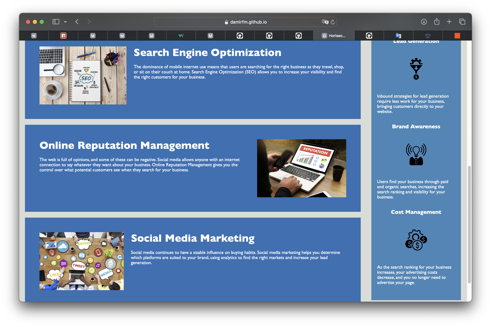

# Horiseon Social Solution Services, Inc. Codebase

Code refactoring of Horiseon Social Solution Services, Inc. agency website.

## Description

This Horieon Social Solution Services, Inc. codebase was refactored for accessibility standards and optimized for search engines. It contains such materials as HTML, CSS and images.

## Link of deployed application

https://damirfm.github.io/Horiseon-Social-Solution-Services-codebase/

## Screenshots of the application

## Installation

N/A

## Usage

To see the refactoring impact on this codebase, you can review the updated HTML and CSS files here or clone this repo into your workstation. For your convenience, you can also check the ISSUES of this project. There you will see a list of topics that have been changed.

## Credits

For doing this job I used this helpful resources: 

- https://coding-boot-camp.github.io/full-stack/github/professional-readme-guide
- https://dev.to/envoy_/150-badges-for-github-pnk

## License

MIT License

## Badges

    

                               
